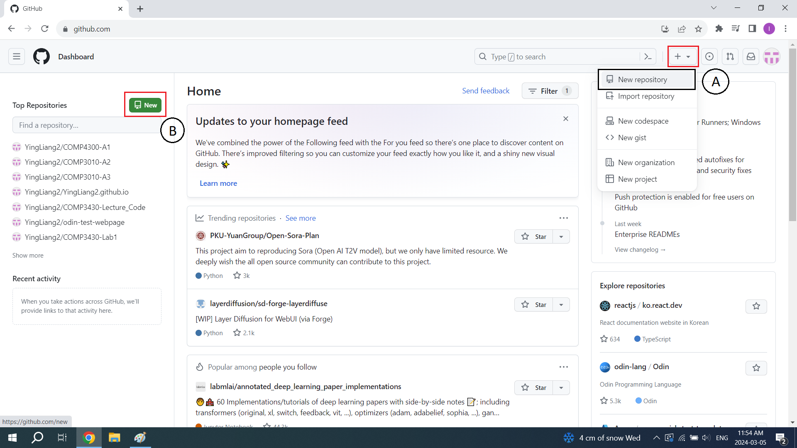
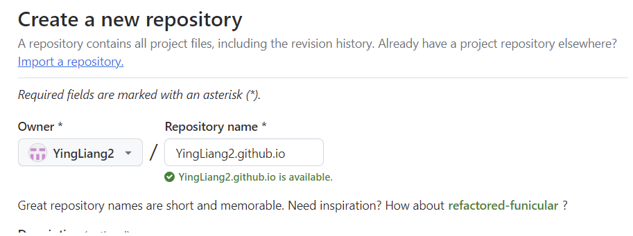
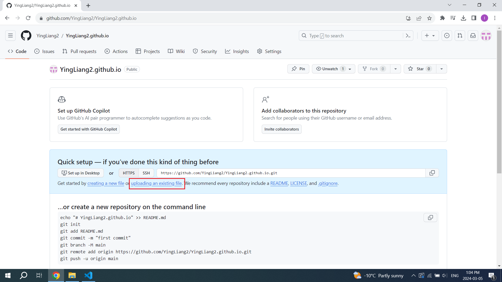
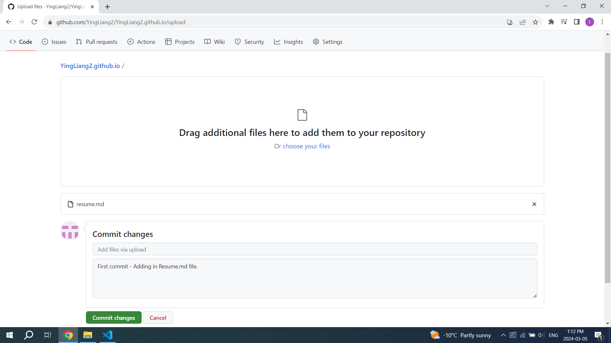
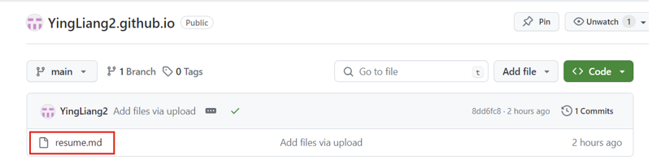
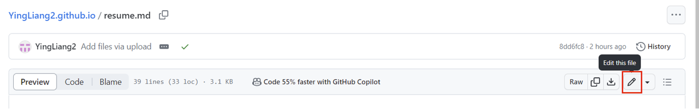
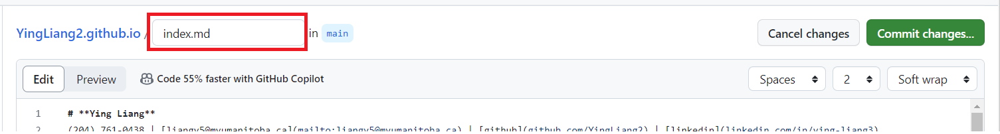
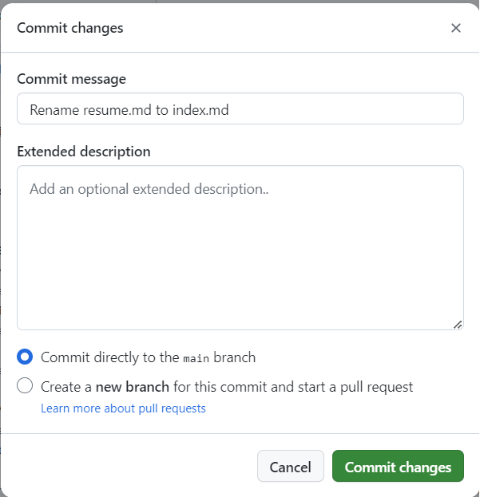

# Hosting a resume on Github Pages and applying principles from "Modern Technical Writing" by Andrew Etter's book when creating a README.

## Purpose
The purpose of this document is to describe the steps to host and format a Resume on Github pages which will allow the user to learn about Markdown, and static websites. Also the document encorporates elements of "Modern Technical Writing" by Andrew Etter to help the user create modern, simplistic and functional documentation - a resume in this case. 

## Table of Contents
* [Prerequisites](#Prerequisites)
* [Instructions](#instructions)
* More Resources
* Author and Acknowledgements
* FAQ

## Prerequisites
* Create a GitHub account [INSERT LINK HERE]

* Basic familarity of Git and version control.
  * Why use Git and Version Control?
    * Version control is one of the core principles from  Etter's *Modern Technical Writing*. It allows colloborators to track different versions and therefore progression and evolution of the document to version it currently exists. Version control also allows collabotors to work on the same file concurrently. Git is one of the most common version control tools that many developers use today.

* [Optional] Read Andrew Etter's book on "Modern Technical Writing" [INSERT LINK HERE]
  * Why read this book?
    * This book provides the techniques and nuances of how to write modern techinical documentation. It explores the intriciacies that we should be wary of before any writing devised and written.

* Basic familiarity and understanding of Markdown [INSERT LINK HERE]

* [Optional] Markdown Editior 
  * It is highly recommended you invest the time into using a markdown editor as it will speed up the process of creating a MARKDOWN document. This tutorial can be fully done using GitHub itself.

* Create a resume formatted/edited in Markdown
  * *Why use Markdown?*
    * *Markdown is a keytool mentioned by Etter's book that is used universally by the tech community. It is a lightweight markup language which has an easy learning curve, very verstile and it is cross-platform compatible. Markdown is the base information and many tools and applications support Markdown therefore cross-platform compatiblity is very high. More importantly due to its ease of use, it allows for colloboration from others.* 

## Instructions
This is a step-by-step guide of first hosting a resume on GitHub Pages and then making changes our our resumes when needed.
  * Why use GitHub?
    * 

1. Log in to your GitHub account and create a new repository named: `[YourGitHubUserName].github.io`

   1. Creating a repository can done in either two ways.
   
      * Option A: First click the "+" sign at the top right (Red Rectangle), then click "New repository" (Black Rectangle)
         
      * Option B: Click the green button (Red Rectangle) that has the text "New" and the image of an floppy disk being inserted 
       

    2. In the "Repository name" field, enter `[YourGitHubUserName].github.io`, then click "Create repository" (green button at the bottom)

       * *Ignore all other fields.*
        

2. Now that you have added the repository successfully. You can begin to add your resume in by committing it to your repository
   
   1. To commit your first file to the repository, click the "uploading an existing file" link.  
      

   2. Add your resume in, saved as "resume.md". Here the commit message box is a description of what you did. So for example in this case, a new file was added. 
      * This step is one the big reasons why version control is useful, as it allows us to keep logs of everything that has been done to this repo.
      

3. To successfully host a static site of your resume, the file name must be changed to `index.md`
    
    1. Click the that you want to edit, in this case `resume.md`
      

    2. Click the Edit button which has the pencil icon.
      
  
    3. Rename the file to `index.md` and then click the *Commit changes...* button in green.
      

    4. Commit the changes to the repository by clicking *Commit changes* button in green again. You may add an optional descriptive commit message if wanted.
      

4. Your resume should be now hosted on GitHub pages. Navigate to `github.com/[YourGitHubUserName].github.io` to check the webpage. Make sure to check all files you uploaded (mainly your resume) has been uploaded are in place.
    * It might take a 5 minutes to 30 minutes to upload the files to the server to host, once it has been uploaded, you should see a green dot in the title of repository.

5. With your resume now hosted, we can fancy it up by adding a Jekyll theme.

    1. First create a new file named `_config.yml`

7. The final product should be look something like this: [INSERT GIF BELOW]

## More Resources

## Authors and Acknowledgements

## FAQs