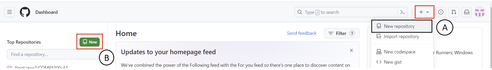
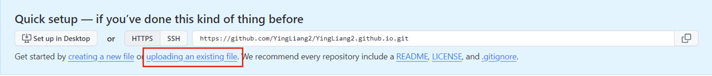
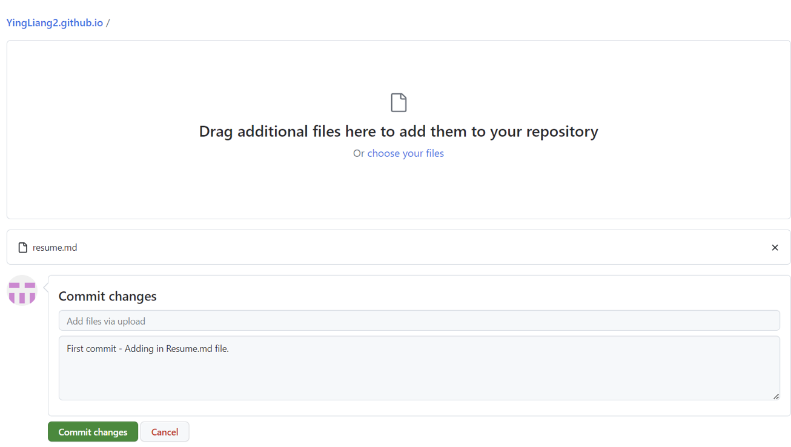
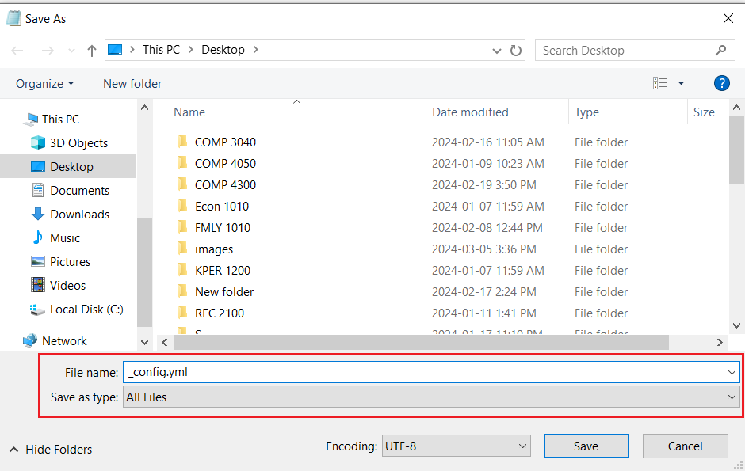

# Hosting a resume on Github Pages and applying principles from "Modern Technical Writing" by Andrew Etter's book when creating a README.

## Purpose
The purpose of this document is to describe the steps to host and format a Resume on Github pages which will allow the user to learn about Markdown, and static websites. Also the document encorporates elements of "Modern Technical Writing" by Andrew Etter to help the user create modern, simplistic and functional documentation - a resume in this case. This tutorial will be done on the Windows Operating System.

## Table of Contents
* [Prerequisites](#Prerequisites)
* [Instructions](#instructions)
* [More Resources](#more-resources)
* [Author and Acknowledgements](#authors-and-acknowledgements)
* [FAQ](#faqs)

## Prerequisites

* [Optional] Read Andrew Etter's book on [*Modern Technical Writing*](#more-resources)

* Create a [GitHub account](https://docs.github.com/en/get-started/start-your-journey/creating-an-account-on-github)

* Basic familarity of Git and version control.

  * *Why use Git and Version Control?*

    * *Version control is one of the core principles from  Etter's *Modern Technical Writing*. It allows colloborators to track different versions and therefore progression and evolution of the document to version it currently exists. Version control also allows collabotors to work on the same file concurrently. Git is one of the most common version control tools that many developers use today.*

  * For a refresher or more learning refer to **GitHub points** in [More Resources section](#more-resources)

* Basic familiarity and understanding of Markdown
    
  * *Why use Markdown?*

    * *Markdown is a keytool mentioned by Etter's book that is used universally by the tech community. It is a lightweight markup language which has an easy learning curve, very verstile and it is cross-platform compatible. Markdown is the base information and many tools and applications support Markdown therefore cross-platform compatiblity is very high. More importantly due to its ease of use, it allows for colloboration from others.* 

  * For a refresher or more learning refer to **Markdown points** in [More Resources section](#more-resources)

* [Optional] Markdown Editior 

  * It is highly recommended you invest the time into using a markdown editor as it will speed up the process of creating a MARKDOWN document. This tutorial can be fully done using GitHub itself.

  * List of recommended **Markdown Editors** in [More Resources section](#more-resources)

* Resume formatted/edited in Markdown with the file named `resume.md`

## Instructions
This is a step-by-step guide of first hosting a resume on GitHub Pages and then making changes our our resumes when needed.
  
  * *Why use GitHub and GitHub Pages*
  
    * GitHub is part of Etter's core principle of Distributed Version Control. Mentioned earlier, version control allows for offline work, easy collaboration and tracking / evolution of the project. GitHub is a solution that can hosts remote repositorys so all parties can easily access the repository from anywhere. GitHub Pages is our static hosting site which is built into GitHub therefore hosting a resume is incredibly easy and seamless. 

1. Log in to your GitHub account and create a new repository named: `[YourGitHubUserName].github.io`

   1. Creating a repository can done in either two ways.
   
      * Option A: First click the "+" sign at the top right (Red Rectangle), then click "New repository" (Black Rectangle)
         
      * Option B: Click the green button (Red Rectangle) that has the text "New" and the image of an floppy disk being inserted 
       

    2. In the "Repository name" field, enter `[YourGitHubUserName].github.io`, then click "Create repository" (green button at the bottom)

       * *Ignore all other fields.*
        

2. Now that you have added the repository successfully. You can begin to add your resume in by committing it to your repository
   
   1. To commit your first file to the repository, click the "uploading an existing file" link.  
      

   2. Add your resume in, saved as "resume.md". Here the commit message box is a description of what you did. So for example in this case, a new file was added. Once you have wrote a commit message (optional) then you can click *Commit changes...* to add the resume to the repository.
      * *This step is one the big reasons why version control is useful, as it allows us to keep logs of everything that has been done to this repo.*
      

3. To successfully host a static site of your resume, the file name must be changed to `index.md`
    
    1. Click the that you want to edit, in this case `resume.md`
      

    2. Click the Edit button which has the pencil icon.
      
  
    3. Rename the file to `index.md` and then click the *Commit changes...* button in green.
      

    4. Commit the changes to the repository by clicking *Commit changes* button in green again. You may add an optional descriptive commit message if wanted.
      

4. Your resume should be now hosted on GitHub pages. Navigate to `github.com/[YourGitHubUserName].github.io` to check the webpage. Make sure to check all files you uploaded (mainly your resume) has been uploaded are in place.
    * It might take a 5 minutes to 30 minutes to upload the files to the server to host, once it has been uploaded, you should see a green dot in the title of repository.

5. With your resume now hosted, we can fancy it up by adding a Jekyll theme by adding a `_config.yml` file.

    1. First create a new text file. 
    2. Add in the line `theme: jekyll-theme-cayman`
    3. Save the file as type: "All Files" with the name `_config.yml`
      

6. Once the filed is saved, commit the `_config.yml` file to the repository. 

7. With the config file comitted you're done! Congratulations. The final product should be look something like this: [INSERT GIF BELOW]

## More Resources

* [Modern Techinical Writing](https://www.amazon.ca/Modern-Technical-Writing-Introduction-Documentation-ebook/dp/B01A2QL9SS) by Andrew Etter. 
* [Markdown basics](https://www.markdownguide.org/basic-syntax/) if you would like a fresher on Markdown. 
* [Markdown tutorial](https://www.markdowntutorial.com/) if you would like to learn the ins and outs of Markdown.
* [Jekyll Themes](https://pages.github.com/themes/) supported on GitHub Pages.
* [GitHub Documentation](https://docs.github.com/en/get-started/start-your-journey/hello-world) for more resources to navigate and learn GitHub 
* [Markdown Editors](https://github.com/mundimark/awesome-markdown-editors) is a list of Markdown editors for all OS and use-cases.

## Authors and Acknowledgements

* Author: Ying Liang - 7893120 
* Edited and reviewed by:
  * 
* Jekyll Theme - Cayman
* Special thanks to Stewart Wilcox for providing the template for this README and providing clear instructions. 

## FAQs

* Why is Markdown better than a word processor?

  * Markdown is a lightweight markup language where it is supported in many different applications natively whereas word processor files are not supported as natively as Markdown. Because Markdown is designed as a markup language, it allows for many applications to just apply CSS Styling to base text formatted in Markdown and it will appear with a certain style on web applications. This process is one of the core principles on why Markdown is supported natively in many websites / web applications. Word files have to manually edited and formatted with the word processor. Because of this tedious process, you can imagine trying to write one single instruction file in Markdown vs a Word processor. If the instructions were written in Markdown it could be easily customized with styles by applying CSS to fit the applications theme and needs, whereas the word file created with a word processor would have to be independently customized each time for a different application.

* Why is my resume not showing up?

  1. Please check your resume file name is `index.md`

  2. Please double check the URL you are visiting. The correct URL is `https://www.[YourGitHubUserName].github.io`. So for example, to visit the GitHub pages for this repository you would enter the url: [`https://yingliang2.github.io/`](https://yingliang2.github.io/)